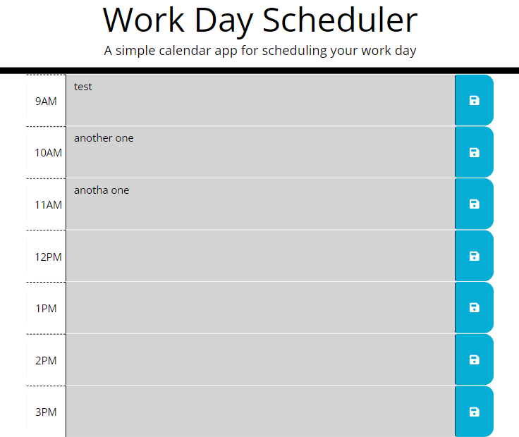

# Day Scheduler
### Homework 05 - Topic: Third-Party API
### Author - Joseph Pugmire

This is a simple calendar application that allows a user to save events for each hour of the day.
This app will run in the browser and feature dynamically updated HTML and CSS powered by jQuery.

### Screenshot

## [Deployed Link]()
